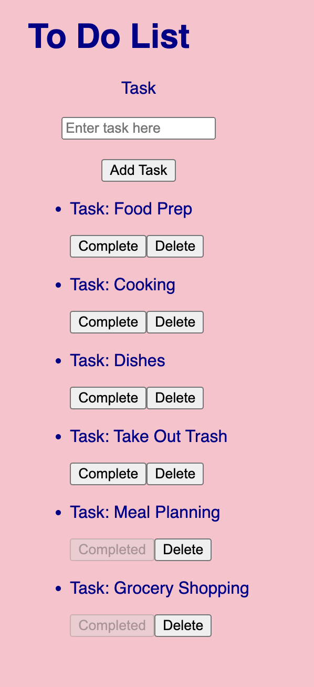

# To Do App

## Description

Duration:  2 Week Sprint

The To Do List Application allows users to input and manage their tasks.

## Features & Instructions ##

- Create task via 'Enter task here' input field
- Enter task via 'Add Task' button
- Each new task has option to Complete or Delete via buttons
- Complete button:
    - Moves task to bottom of task list on display
    - Button changes to Completed and is visually grayed out on display
    - Database stores task completion status
- Delete button:
    - Removes task from from list on display
    - Removes task from database

## Screen Shot

## Prerequisites

- Node.js
- npm
- PostgreSQL

## Built With

- Visual Studio Code
- HTML
- CSS
- JS
- React
- Node.js
- Express
- POstgreSQL
- Postico
- Postman
- Github

## Acknowledgement

Thank you to Prime Digital Academy, especially Andrew, Chris and Carlos who taught and guided me to make this application a reality. Sincere thanks and appreciation to my development partner Isaac Amano - together we accomplish great things!

## Support

All suggestions are welcome! Please reach out via email with suggestions or questions to tmhsllc@icloud.com.